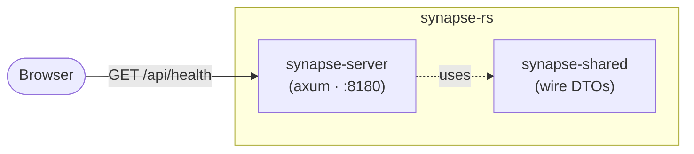

# Architecture — synapse-rs

The C4 model for the rebuild. LikeC4 sources join when the shape has enough parts to be worth a
model (the oracle's `docs/architecture/` is the reference until then); each build-book chapter
opens with its HLD delta as a Mermaid diagram, and this page holds the current container view.

## Containers (step 01)

The client (Leptos/WASM), content tree, Postgres, go-judge, Keycloak, and LikeC4 join this
diagram as their steps land — the oracle's final shape is the destination.
