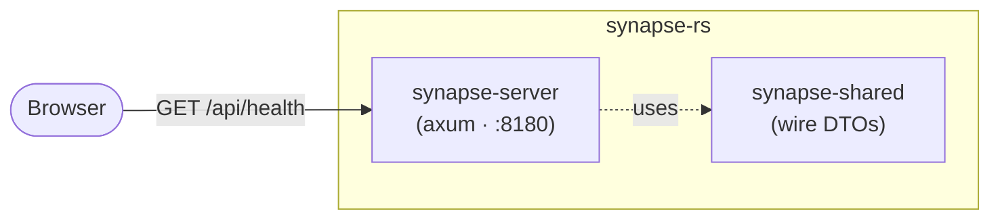

# Architecture — synapse-rs

The C4 model for the rebuild. Each build-book chapter opens with its HLD delta as a diagram, and
this page holds the current container view. Diagrams are `d2` or `mermaid` fences drawn from the
source beside them (ADR-RS009, ADR-RS010) — there is no separate model file and no viewer.

## Containers (step 01)

```mermaid
graph LR
    browser([Browser])
    subgraph synapse-rs
        server["synapse-server<br/>(axum · :8180)"]
        shared["synapse-shared<br/>(wire DTOs)"]
    end
    browser -- "GET /api/health" --> server
    server -. uses .-> shared
```

The web tier (Astro SSR + islands), content tree, Postgres, go-judge, Keycloak and the `d2-render`
sidecar join this diagram as their steps land.
