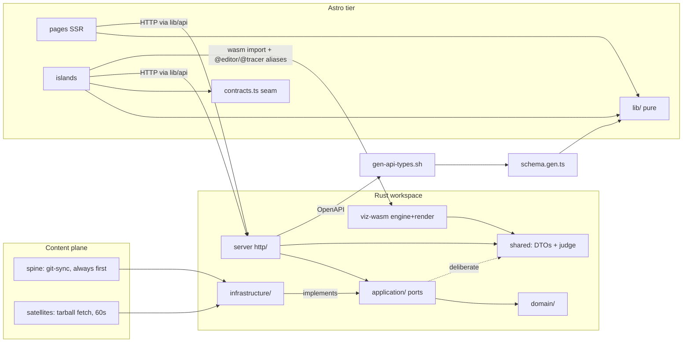

# Hexagonal/DDD audit — post-Astro, multi-repo edition

Second edition of the architecture audit. The first (2026-07-20, `docs/refactor/00-audit.md`,
now living only in git history — the build-book pruning took the directory) audited a
Rust-server + Leptos-CSR two-crate world. Since then the page tier moved to **Astro SSR**
(the Leptos client is deleted; `viz-wasm` is the surviving wasm crate), the server grew the
**authoring** context and **multi-repo content** (ADR-RS004/RS005), and the content itself
split into a spine + five satellite repositories. This edition re-audits everything and
tracks each prior finding to its current status.

**Ground rules** (carried from the first edition, user-approved): *honest mapping* — every
checklist idea is evaluated against this system's real equivalent, N/A premises get one
line of why; genuine findings only. Audited at `main` HEAD `7195f15` with three tree states
observed and untouched: uncommitted platform WIP (catalog walker stem-prefix fix +
`dev-tools/dev` satellite list), an uncommitted spine `.gitignore` rewrite, and 26
uncommitted changes in `dsa-guide` (see §2 rows and §7). `sql-guide` excluded per
instruction (unfinished; its slugless `book.json` would be refused by `validate-book`,
which is the system working).

How the playbook maps onto the four tiers now:

| Playbook term | This system's equivalent |
|---|---|
| `#[server]` functions | axum handlers (`server/src/*/http/`) **and** Astro page frontmatter (`web/src/pages/*.astro`) |
| SSR/hydrate/islands mode | Astro `output: "server"` + manually-mounted islands (zero `client:*` directives — hydration is hoisted-script `render(h(…))`) |
| `Resource`/`Action`/`Effect` closures | island event handlers + Preact hooks in `web/src/islands/` |
| `provide_context` of infrastructure | the `contracts.ts` window-provider/CustomEvent seam + module singletons |
| Errors at the edge | per-context `to_error` DTO mapping (axum) · `ApiFailure` (web fetch edge) |

---

## 1. Current structure

```
Cargo.toml     members = ["shared", "server", "viz-wasm"]
├── shared/    wire kernel: DTOs + shared judge; dep = serde (+ optional utoipa)   645 L
├── server/    axum binary — hexagonal by bounded context; feature: render-local-only
├── viz-wasm/  the viz engine (pure) + Leptos renderers/modal, cdylib+rlib
├── web/       Astro 5.18 SSR (@astrojs/node standalone) + TS/Preact islands      18,042 L src
├── api/       openapi.oracle.yaml — the contract-lock oracle (contract_it.rs)
├── runner/    the go-judge sandbox image (toolchains under mounted paths only)
├── e2e/       Playwright suite + fixture-java-guide (the path-mounted satellite)
└── migrations/ 0001…0007
```

**Server** — ten contexts: six full hexagons (`authoring` NEW, `blog`, `catalog` heavily
grown, `execution`, `identity`, `submission`), `tutoring` (no domain), flat `insights` +
`progress`, and 20-module flat `platform` (+`astro_proxy`, `admin_gate`). The doctrine
comment survives verbatim at `server/src/lib.rs:1-4`.

**Web** — 8 pages, 1 layout, 8 components, 44 island files (21 vanilla TS + 23 Preact —
the "vanilla by default, Preact only where component state" rule is honoured file-by-file,
each with an in-file justification), and a real logic layer at `web/src/lib/` (29 modules,
17 with colocated tests). Wire types are **generated**, not shared: `dev-tools/
gen-api-types.sh` → `schema.gen.ts` (2,524 L, git-tracked, CI drift-gated at
`ci.yml:284-293`), re-exported under domain names by `lib/api/client.ts`.

**viz-wasm** — pure `engine/` (10 modules; purity structurally gated) + Leptos `render/`,
`modal`, and a wasm-bindgen `entry` exposing exactly three exports (`viz_mount_widgets`,
`viz_open_modal`, `viz_install_token`). Signals that outlive views are minted under
detached root Owners in two documented places (`entry.rs:23-28`, `session.rs:44-50`);
mounts are marker-idempotent (`blocks.rs:42-47`).

**Content plane** — the spine (`synapse-content`: two remaining books, the blog, ONE
`category.json`, the single LikeC4 `specification {}`, and the gathering build that
`likec4 validate`s the merged workspace before any image) plus five satellites whose root
IS the book. Registration rows own grouping+order; `book.json` owns the slug
(`migrations/0006:16-18` states why in the schema itself).

**Feature flags** — still minimal and all accounted for: shared's `openapi`; the server's
`render-local-only` (a cargo feature *so the prod binary cannot contain the branch*,
ADR-RS002 — enabled only by `dev-tools/dev:89`, asserted absent from the image by the
conventions gate); no web-side build flags (feature availability is a runtime server probe
— `CONTENT_FORGE=off` ⇒ structural 404s the client treats as "editing is off",
`client.ts:306-308`).

---

## 2. Findings

Severity: H = can bite users/operators · M = real debt worth a step · L = cheap
tightening · NHJ = deliberate, see §8 · [user] = a tree-state only the user can settle.

### 2a. Carried over from the first edition

| file:line | Finding | Sev | Status |
|---|---|---|---|
| `server/src/submission/domain/mod.rs:21-33` | `Submission` aggregate: all 7 fields `pub`, transitions (`judging()`/`completed()`) enforced by convention, built by struct literal in the application. | M | **unchanged** |
| `server/src/identity/infrastructure/jwks.rs:138-144` + `submission/http/admin.rs:105` + `authoring/http/admin.rs:81,119` | Canonical-lowercase username is still a convention, not a type — and now feeds **three** bare-`String` comparison surfaces (submit allowlist, content-editor allowlist, `ADMIN_USERS`) plus four unrelated `username: String` fields. A `Username` newtype would unify all of it. | M | **worsened** (2 lists + admin set) |
| `execution/application/mod.rs:5` · `submission/application/mod.rs:8` · `tutoring/application/mod.rs:5` · `submission/domain/mod.rs:8` · **NEW** `catalog/domain/lesson.rs:4` | Wire types as inner-layer data: `RunRequest`/`RunResult`, `TestSpec` + the `judge`/`stdin_for` *behaviour*, `ChatMessage`, `RunStatus` inside `FailedCase` — plus `TestSpec` now also in catalog's domain. New contexts (authoring, registry) are clean. | NHJ | unchanged +1 |
| `dev-tools/check-conventions.sh:31-32,49-50` | Both purity greps remain `^\s*use`-anchored — a fully-qualified `sqlx::query(…)` in domain or `web_sys::window()` under `engine/` passes silently (and `entry.rs`/`theme.rs` show that exact call style is house-normal outside the gate). Latent; sweeps confirm not exploited. | L | **unchanged** |
| `catalog/domain/content_tree.rs:50,62` | `BookMeta`/`CategoryMeta` derive `Deserialize` in domain — sanctioned by the gate's own "std + serde" line. | NHJ | unchanged |
| `execution/http` + `submission/http` + `authoring/http/mod.rs:225-245` | The authed-vs-anon rate-limit metering/`over_budget` shape now appears in **three** http modules — consistent convention, still platform policy living in handlers. | L | grew by one |

**Resolved by deletion** (the Leptos client): the 22 `Result<_, String>` api functions,
`AsyncResult::Failed(String)`, the verdict-badge closure, ChromeState dual delivery — all
gone with the tier. The error finding has a **successor in weakened form**, next table.

### 2b. New — server

| file:line | Finding | Sev |
|---|---|---|
| `server/src/main.rs:194` + `catalog/infrastructure/sync.rs:82` + `catalog/infrastructure/postgres.rs:47-48` | **First-source-wins has no single home.** The invariant that makes migration safe ("the primary serves while both copies exist") is a three-layer conspiracy: construction order in `main.rs`, pinned-first re-publishing in the sync loop, and the SQL `order by enabled desc, sort_order nulls last, id`. Nothing makes a violation unrepresentable; each layer alone looks innocent. The merge itself (`domain/merge.rs:110-129`) is exemplary — it's the *ordering upstream* that is diffuse. | **M** |
| `catalog/http/admin.rs:259-271` | Registry **defaulting policy in the handler**: `"main"` default branch and `enabled: true` decided at the http layer, duplicated by SQL defaults (`0006:22,25`), stated nowhere in application/domain. Three homes, no owner. | M |
| `authoring/domain/edit.rs:58-81` | `EditRequest` — a second all-`pub`-field aggregate. Better guarded than `Submission` (named `opened()` constructor + `#[must_use]` transitions the service exclusively uses) but the fields remain assignable; the FSM is still convention. | L |
| `catalog/application/content_sources.rs:66-91,104` | `ContentSources` is the one new DAO-shaped port (`upsert`/`record_sync` are storage verbs), and `ContentSourceDraft::validate()` enforces *domain* rules (slug-shape, `owner/name`) from an application struct returning an application error. | L |
| `authoring/application/mod.rs:209` | Type erasure at a seam: the typed `InvalidEdit` is flattened into `AuthoringError::Invalid(e.to_string())`; likewise `RegistryError` → `ContentError::Io(String)` (`content_sources.rs:134-138`). The thiserror-enums-with-String-payloads convention continues into the new contexts (all 8 `AuthoringError` variants carry `String`). `FetchError::RateLimited { seconds: u64 }` is the one step toward typing. | L/NHJ |
| `catalog/infrastructure/sync.rs:28` | Dead code: `DEFAULT_INTERVAL` re-exported, zero consumers. | L |

### 2c. New — gates, CI, deploy

| file:line | Finding | Sev |
|---|---|---|
| `dev-tools/check-conventions.sh:83-88` | The render-local-only check `exit 1`s immediately instead of `fail=1` — a hit **silently skips the file-cap check**, contradicting the script's own "every violation listed in one run" promise (`:19-21`). | M |
| `.github/workflows/ci.yml:457` | The `coverage` job (88% floor) is **not in `release.needs`** — a coverage failure does not block a deploy. Whether that is intended deserves one line of documentation either way. | M |
| `server/src/config.rs:57` + `lib.rs:173` | `astro_url: Option<String>` has **no empty-string guard in Rust** — figment yields `Some("")`, which mounts the proxy at nowhere and 502s every page. The only defence is `start.sh:12-21` unsetting it; any other entrypoint (a k8s manifest setting `SYNAPSE_ASTRO_URL: ""` with a different command) re-opens it. The `.filter(|s| !s.is_empty())` idiom already exists in this file for `admin_users` (`config.rs:177`). | M |
| `ci.yml:135` | `content_sources_it.rs` (and `progress_it.rs`) are `POSTGRES_IT`-gated, but the prove-it-ran guard only inspects `--test postgres_it` — a silently-skipping registry IT would stay green. The go-judge guard also lacks the positive-count check its two siblings have (`:404-410` vs `:182-190`). | M |
| `viz-wasm/tests/cortex_goldens.rs:4,35` | Doc drift: header says *three* deliberate delta fields, the fn doc says *four*, `normalize` erases five. The gate itself (16 fixtures, byte-exact) is healthy. | L |
| `api/openapi.oracle.yaml:5-8` | The contract-lock oracle's `info.description` still describes the Scala/tapir pipeline — stale prose on a live gate. | L |
| `web/tsconfig.json` | Dead `@styles/*` path alias → the **deleted** `client/` directory; zero usages. | L |

### 2d. New — web tier

| file:line | Finding | Sev |
|---|---|---|
| `web/src/islands/reader.ts:253` | The **single un-typed cross-island edge**: `addEventListener("synapse:open-contents", …)` as a string literal instead of the imported `OPEN_CONTENTS` — in a file that already imports from `contracts.ts:31`. Exactly the failure mode the contracts header warns about; every other seam (9 events, 3 window providers, 14 importers) is declared and used. | L |
| `web/src/pages/synapse/[...path].astro:50-55` · `components/Pager.astro:12-18` · `pages/blog/[slug].astro:33-37` | `humanise()` implemented **three times in frontmatter — three spellings, two different behaviours, zero tests**. The one genuine logic-in-frontmatter finding; belongs in `lib/` beside `seo.ts`. | M |
| `web/src/islands/auth/{AccountPanel:33,AllowlistSection:34,ContentSourcesSection:41}.tsx` | The old stringly-error finding's successor: the fetch edge is now **typed** (`ApiFailure` with status + envelope, `client.ts:103-118` — a real improvement), but one hop in, three copy-pasted helpers narrow to `ApiFailure` and then discard the narrowing (all arms yield `.message`), and ~14 more sites flatten to `error.message`. Status codes survive only where a page explicitly asks (the 404-vs-502 splits do this right). | M |
| `web/styles/blog-post.css` (1,494 L) | CSS is outside the size caps (`check-conventions.sh` predicate covers ts/tsx/astro only) — one sheet is 30% of all CSS and 2.3× the next largest, guarded only by the parse-sanity test. | L |
| `web/src/islands/widgets/{Diagrams,C4Embed}.tsx` | The "followable from logs alone" rule has two gaps: Diagrams renders its error path without logging it; C4Embed attaches its iframe bridge silently. (14 islands import no logger; most are legitimately silent pure/presentational modules.) | L |

### 2e. New — content plane

| Where | Finding | Sev |
|---|---|---|
| satellites' `book.json` `order` + registry row `sort_order` + `dev-tools/dev:74-81` | **`order` is stated in three places** with nothing checking agreement. Today they match; a row registered without an order silently falls back to the (stale-able) `book.json` value. | M |
| `synapse-content/c4-sources.json` | The gathering build's registry fallback is hand-maintained and fires exactly when nobody is watching ("registry unreachable" → warning + fallback). A future `.c4` in a satellite it doesn't list yields a green build with those diagrams missing — and per the landmine list, a missing diagram is invisible from HTTP status. | M |
| prod Postgres only | **The production registry rows are unverifiable from any repository.** The only checked-in statement of prod placements is a comment-guarded shell array in `dev-tools/dev` ("Placements MATCH PRODUCTION"). The §4 URL-reproduction proof rests on that comment being true. An `/api/admin/content-sources` export checked into the spine (or an e2e against prod) would close it. | M |
| `dsa-guide` working tree | 26 uncommitted changes incl. lesson deletions (`_05-recursion/**` — underscore-excluded, so no live URL implicated). Prod serves the `main` tarball; the local tree diverges. | [user] |
| `synapse-content/.gitignore` (uncommitted diff) | A rewrite of the ADR-RS002 first-line protection sits unreviewed in the spine (coverage verified equivalent — `learn-french` moved under `local-only-content/` — but it should be reviewed and committed deliberately). | [user] |
| `programming-languages/category.json` | A new *grouping* with title/icon still needs a spine content push — a soft, documented edge on "which sources exist is a row, not a redeploy" (bare-directory groupings work without it, `merge.rs:56-58`). | NHJ |

**Explicit zero-findings this edition** (each checked, absent): no framework derives on
any domain type beyond the sanctioned serde pair; no handler branches on domain state
(owner checks in application; tutoring/authoring/registry mounting is structural); no
`unwrap`/`expect`/`panic` allows outside `#[cfg(test)]` (three justified
`unreachable!`/static-regex sites); zero raw `fetch` outside `lib/api/client.ts`; no
tokens or Keycloak handles outside the auth adapter/store; `localStorage` funnelled
through `lib/storage.ts` (one documented pre-paint exception); zero `client:*` directives;
zero TODO/HACK/FIXME markers in the web tier; no direct DB/FS/`shared` access from Astro
frontmatter (SSR fetches over HTTP like the browser); duplicate book slugs across sources:
**none** — the cutover is complete, verified by walking both sides (160 + 67 URLs exact).

---

## 3. Bounded contexts now

The server's ten plus two that live outside it:

| Context | Aggregates / roots | Invariants — and where enforced |
|---|---|---|
| **authoring** (new) | `EditRequest` + `EditRequestState` | commit→PR→record ORDER chosen for failure recovery (`application/mod.rs:176-180`); PR idempotency at the forge port; branch uniqueness **per repo** in SQL (`0007:21`); NEW-vs-REVISION routing = the two-lookup `Forges` rule (`ports.rs:104-119`) — a book migrating mid-review follows its stored repo |
| **catalog** (grown) | `SourceTree` → `merge::assemble` → the catalog | root-`book.json`-IS-a-book (RS005, walker `:183-186`); first-source-wins (`merge.rs:110-129`, ordering upstream diffuse — §2b); conflicts are **data** (`CatalogWarning`, three variants) not logs, with the purity rationale in the type's doc; slug uniqueness deliberately NOT in SQL (`0006:16-18`) |
| submission | `Submission` FSM | unchanged from first edition (ADT states, convention transitions, SQL `completed_shape` backstop) |
| identity | `AuthenticatedUser` | canonical lowercase at the verifier — convention, now 3 consumers (§2a) |
| execution / blog / tutoring / insights / progress | — | unchanged shapes; insights/progress deliberately flat |
| **web lib/** (the client-side "domain") | pure modules with headers claiming and tests pinning purity | the mirrored trio is the risk: `lib/execution/judge.ts` ("mirrors `shared` — used by both sides"), `language.ts` ("server stays the authority"), `markdown/frontmatter.ts` ("MUST agree with the Rust splitter") — see §6 risk 4 |
| **viz engine** | `VizCases`/`VizGraph` | purity structurally gated; detached-owner rule stated at both mint sites; 93 native tests + the 16-golden byte-exact parity gate |

---

## 4. Ports now — 20, with verdicts

Native AFIT throughout; `ReadinessProbe` remains the sole documented `dyn` exception.
Full inventory in the survey; the verdicts that matter:

- **Exemplary (use-case-shaped, and self-aware about it):** `ContentForge` — "commit this
  file, open a pull request", not "PUT /contents, POST /pulls"; the **dry-run adapter is a
  shipped mode, not a mock** (`CONTENT_FORGE=dry-run`), which is the strongest seam
  evidence in the codebase — two real adapters, one port, chosen per deployment *and per
  edit* (`Forges` routes satellites' PRs to their own repos). `ContentFetcher` — one
  method deliberately hiding the two-call head/archive protocol.
- **Fine:** `ContentEditors` (mirrors `SubmissionAllowlist`, four verbs one capability,
  with the two-allowlists blast-radius rationale stated in migration `0005:7-11` *and*
  code); `EditRequestRepository` (CRUD-ish but `open_for`/`highest_attempt` exist because
  of the reuse rule, not because rows exist); `LessonSource`, `Placements` (a published
  snapshot, poisoned-lock degrades to empty rather than panicking).
- **DAO-discussion candidates:** `SubmissionRepository` (unchanged verdict from the first
  edition) and the new `ContentSources` (§2b).
- **Signature drift:** `ContentRepository` is the one pre-existing port that changed for
  multi-source — `load_sources() -> Vec<SourceTree>` and two-arg `read_lesson(source_id,
  path)` with unknown-id-is-NotFound (never fall-through — the cross-serving guard is in
  the port contract's own doc).
- `AppDeps` remains 3-generic (`L`, `V`, `C`); `authoring` and `content_sources` mount as
  `Option` (structural 404 off), with `content_sources` deliberately concrete — documented
  in the field doc as "no test fakes it through the router".

---

## 5. Test reality

**543 Rust** (299 server-inline + 120 server-IT across 26 files + 13 shared + 111
viz-wasm) · **212 vitest** across 22 files · **24 Playwright** across 6 specs (incl.
`satellite.spec.ts` proving the grafted URL indistinguishable, and the two authoring
specs incl. a signed-in full click-path against dry-run) · gated live suites
(`POSTGRES_IT` ×3 files, `GOJUDGE_IT` ×2) with prove-they-ran CI guards.

Where it is thin, honestly:

1. **The prove-it-ran gap** (§2c): registry + progress Postgres ITs and the go-judge
   positive count are outside the guards that exist for their siblings.
2. **`.tsx` islands** are e2e-covered by explicit design (excluded from the coverage
   denominator with the rationale in `vitest.config.ts:20-24`) — the e2e suite covers
   reader/problem/satellite/authoring/mobile paths but not, e.g., the admin panel's
   registry screens beyond 401s, the coach, or Codebench.
3. **The mirror pins are asymmetric**: shared's judge has a vectors file
   (`shared/test-vectors/judge-vectors.json`) exercised on the Rust side; web's
   `judge.test.ts` has 2 tests and does not consume the vectors. `language.ts` and
   `frontmatter.ts` similarly rely on comment-discipline ("MUST agree") plus small local
   suites. Nothing mechanically diffs the mirrors against the Rust authority.
4. **Coverage floor is not release-blocking** (§2c).

---

## 6. Dependency graph + risk register



Enforced: crate graph (web never links Rust; viz-wasm/server only meet in `shared`);
conventions gate (domain purity, engine purity, render-local-only absence, caps);
the schema drift-gate (wire parity web↔server); axum route precedence (registered routes
always beat the Astro fallback — a page path can never shadow `/api`). Conventional:
first-source-wins ordering (§2b), the JS mirrors (§5.3), `order` agreement (§2e).

**Risk register — the changes most likely to break behavior now:**

1. **Reshaping any wire DTO** — now breaks *two* consumers: the Rust contract lock
   (`contract_it.rs` vs `api/openapi.oracle.yaml`) and every `schema.gen.ts` importer.
   Both are gated (contract IT + drift check), which converts silent breakage into loud
   CI — the risk is edits that thread the gates (semantic changes with stable shapes).
2. **Touching the sync/merge ordering** — first-source-wins lives in three places (§2b);
   a refactor of any one of `main.rs` wiring, the sync loop's pinning, or the registry
   query's `order by` can invert a migration-window winner with every test still green
   (the e2e satellite fixture pins the graft, not the contest).
3. **The 202-detached judging lifecycle** — unchanged from the first edition
   (`tokio::spawn` outliving the request, boot-time reconcile); pinned by the gated
   Postgres IT only.
4. **The JS mirrors drifting** — `judge.ts`/`language.ts`/`frontmatter.ts` MUST agree
   with their Rust authorities; the pinning is asymmetric (§5.3). A Rust-side judge or
   frontmatter change that forgets the TS mirror ships a client that disagrees with the
   server about verdicts or fence parsing.
5. **Deploy-shape regressions** — the `Some("")` astro_url 502 (§2c) and the two-process
   `wait -n` supervision: both defended in `start.sh` alone; any alternative entrypoint
   or manifest bypasses them. The e2e job runs the true two-process shape, which is the
   real pin.
6. **Future book migrations** — the machinery held for five books (URL walks proved 227
   URLs exact), but the preconditions remain manual: slug+grouping reproduction has no
   automated check against prod rows (§2e), and the c4-sources fallback under-reports
   (§2e). The next cutover re-runs these risks with less novelty and possibly less care.

---

## 7. Phase 1–4 applicability (compact refresh)

The first edition's verdicts stand with three updates:

- **Phase 1 (safety net)**: still satisfied-and-stricter, with the §2c/§5 guard gaps as
  the punch-list (prove-it-ran coverage, release-gating coverage or documenting why not).
- **Phase 2 (domain purification)**: the real content remains the same two type-steps —
  `Submission` (now also `EditRequest`) encapsulation and the `Username` newtype (now
  worth more: three consumer surfaces) — plus the new one: give first-source-wins a
  single home (e.g. the ordered source list as a constructed type whose invariant is
  "primary first", built in exactly one place).
- **Phase 3 (`async_trait`/`Arc<dyn>` use-cases)**: conflicts with house AFIT/static
  dispatch as before; the new authoring context demonstrates the house pattern scaling
  (4-generic service, per-edit adapter selection) without either.
- **Phase 4 (crate-per-layer)**: rejected as before; the Astro migration actually *added*
  a boundary the playbook never imagined (wire types crossing tiers by **code
  generation** rather than a shared crate) and it is working — drift-gated, vocabulary
  renamed at one seam (`client.ts`).

---

## 8. Decisions on the judgement calls

All eight items carried as open are now **decided**. Six are *keep* — the current shape is
the right production trade, and the work is to harden the line around it rather than move
it. Two carry a real change. Each decision names its residue and the step that owns it.

1. **Wire types as inner-layer data — KEEP.** Separate domain types plus edge conversions
   pay off when the two sides version independently: public API consumers, old clients,
   staged rollout. Nothing here versions independently — server, generated TS and wasm
   ship in one image on one release, and the TS half is drift-gated in CI. Separate types
   would buy four conversion seams and no beneficiary.
   **Residue:** `RunStatus` is not only a wire enum. A completed submission persists it
   inside JSONB, so its serde names are simultaneously a *storage* format and renaming a
   variant is a data migration, not an API tweak. That fact belongs on the type. → step 2.4
   The second line holds unchanged: new contexts stay clean (authoring already proves it).
2. **Stringly error payloads — KEEP the convention, and write down the rule that governs
   it.** The production test for any error field is: *does code ever branch on it, or do
   only humans read it?* Humans-read-it → `String` is honest and cheap. Code-branches-on-it
   → it must be typed. The codebase already discovered this empirically —
   `FetchError::RateLimited { seconds: u64 }` is typed precisely because the sync loop
   reacts to it. **Residue:** state the rule in the conventions, and fix the two sites that
   violate its spirit by erasing *before* the edge (`AuthoringError::Invalid(e.to_string())`
   discarding a typed `InvalidEdit`; `RegistryError` → `ContentError::Io(String)`). → 2.4
3. **serde in catalog domain — KEEP; spend the effort on enforcement instead.**
   `BookMeta`/`CategoryMeta` decode author-controlled marker files leniently, which *is*
   the domain behaviour ("malformed degrades, never fails"); serde carries no IO, no
   runtime, no failure mode the domain doesn't already own. **Residue:** the sanctioned
   line is "std + serde, never sqlx/utoipa/axum" — but the gate defending it only sees
   `use` statements. A permitted exception is fine; an *unenforced* boundary around it is
   not. → step 1.1
4. **`ContentSources`' DAO shape — KEEP.** Repository abstraction earns its keep when the
   stored thing is an aggregate with invariants to protect. A content-source row is
   configuration: the row *is* the model, and `record_sync` writing `last_sha`/`last_error`
   is what makes the admin screen useful during an incident. Renaming verbs is cosmetics.
   **Residue:** `ContentSourceDraft::validate()` is called from the Postgres adapter, so
   "only valid rows reach storage" is currently the *adapter's* promise; it should be the
   application's, where a second adapter cannot forget it. Move the call, not the shape.
   → step 2.2
5. **`content_sources` concrete in `AppDeps` — KEEP concrete.** This is the house rule
   applied correctly: genericity where a fake exists, concreteness where none does. The
   registry has 13 tests across its route and store ITs and no full-router fake. Making it
   generic now is speculative interface — the thing this codebase has been disciplined
   about refusing. If a second store ever appears, the change is mechanical. No residue.
6. **Grouping-title via spine push — KEEP the exception.** Groupings change a few times a
   year and are *editorial* acts (title, icon, curation order); the spine is the declared
   home of editorial structure, and a push is minutes through git-sync. The alternative —
   a groupings table, migration, admin screen, and one more thing prod Postgres owns that
   no repository can verify — is permanent surface for a rare event. Revisit only if
   grouping creation ever has to happen without git access. No residue.
7. **`.tsx` islands e2e-owned — KEEP the strategy, close one gap.** Unit-test the pure
   layer (done, heavily), e2e the real flows, and don't build a jsdom middle tier that
   tests implementation detail and rots. But apply the strategy's own logic to §5.2 and one
   surface stands out: **the admin registry screens are incident tooling** — if registering
   or disabling a source breaks, you find out during a content incident. That is exactly
   what e2e should own, and the harness already has the signed-in pattern and Postgres.
   The coach stays uncovered and that is correct: `TUTOR_ENABLED=off` in production, and
   testing a disabled feature is negative value. → step 4.2
8. **`order` in `book.json` — CHANGE: make the row the sole authority for satellites.**
   Three homes with silent-fallback semantics is the configuration shape that produces
   production mysteries ("why did the library reorder after we re-registered?"). The
   nuance: `order` is not globally dead — it is how the spine's own *collection-walked*
   books order themselves. So the rule is **collection-walked books order via `book.json`;
   registered satellites order via their row, full stop** — enforced by requiring
   `sort_order` at registration, a `validate-book` warning when a root-level `book.json`
   carries `order`, and deleting the field from the five satellites. Fail-loud replaces
   silent-stale-fallback. → steps 3.1, 3.2

---

## 9. The execution plan

The findings and the residues above are sequenced into five phases of small, independently
revertible steps. Full briefs — scope, acceptance gates, landmines — live in the working
plan at `~/.claude/plans/misty-skipping-lecun.md`; this is the map.

| Phase | Steps | Theme |
|---|---|---|
| **1 — Trust the machinery** | 1.1 gate integrity (`fail=1` + bare-path purity greps) · 1.2 CI guard coverage + release gating · 1.3 `astro_url` empty-string guard | The gates protect every later step, so they go first |
| **2 — Server invariants** | 2.1 first-source-wins gets one home · 2.2 registry policy into the application · 2.3 `Username` newtype · 2.4 error-payload rule + two erasure sites + `RunStatus` storage comment · *(2.5 optional: aggregate encapsulation)* | The real design debt |
| **3 — Content authority** | 3.1 the row is the sole order authority · 3.2 satellite `book.json` cleanup (platform prepares, user pushes) · 3.3 registry visibility + `c4-sources.json` derived from `/api/c4/sources` | One truth per fact, and make the truth visible |
| **4 — Web tier & test reach** | 4.1 web tidy quartet · 4.2 admin registry e2e · 4.3 judge-vector mirror pin | Close §2d and the §5.3 asymmetry |
| **5 — Housekeeping** | 5.1 residue batch (dead `DEFAULT_INTERVAL`, cortex-golden doc drift, stale oracle prose, two island logging gaps) | Trivia, batched |

Ordering rationale: phase 1 first because a gate that silently skips a check makes every
later "CI is green" claim weaker; phase 3 after phase 2 because the order-authority change
lands cleanest once registry policy already sits in the application; phase 4 is independent
and could move earlier if web work is more urgent.
