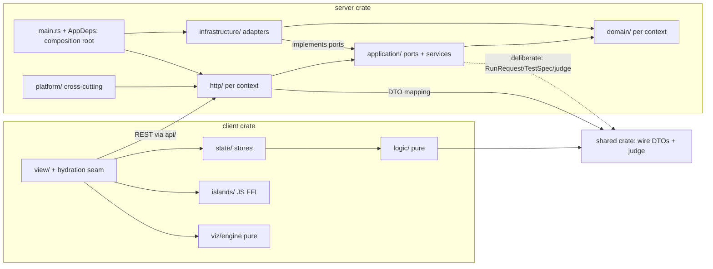

# Phase 0 — Hexagonal/DDD audit

Read-only audit of synapse-rs against the staged refactor playbook (audit → safety net →
domain extraction → ports/use-cases → crate split). **Ground rule agreed before writing:
honest mapping.** The playbook targets a `#[server]`-function SSR Leptos app; synapse-rs
is a CSR Leptos client speaking REST to an axum server over a shared wire-DTO crate, and
is *already* hexagonal by bounded context. Each checklist item is therefore evaluated
against this codebase's real equivalent; premises with no equivalent get an explicit N/A
with the reason. Findings are genuine or absent — no template-filling.

How the checklist maps here:

| Playbook term | This codebase's equivalent |
|---|---|
| `#[server]` functions | axum handlers in each context's `http/` module |
| SSR / hydrate / islands mode | CSR only; "hydration" in this repo means CSR island mounting (`client/src/hydration.rs`), not SSR hydration |
| `Resource`/`Action`/`Effect` closures | `Effect`/`Memo`/derived-signal closures in `client/src/*/view/` |
| `provide_context` of infrastructure | the client's context-store inventory |
| Server-function error edge | per-context `to_error`/`to_auth_error` DTO mapping in `http/` |

Audited at commit `0efbca5` (step-65; clean tree). Suite: **470 rust + 83 vitest** plus an
always-on Playwright e2e job.

---

## 1. Current structure

### Workspace

```
Cargo.toml            resolver = "2", members = ["shared", "server", "client"]   (Cargo.toml:1-3)
├── shared/           synapse-shared — wire DTOs + the shared judge; deps: serde (+ optional utoipa)
├── server/           synapse-server — axum binary; hexagonal by bounded context
└── client/           synapse-client — Leptos 0.8 CSR (cdylib+rlib), three-layer by feature
```

Server crate, per bounded context (`server/src/lib.rs:6-14`): `catalog`, `execution`,
`submission`, `identity`, `blog`, `tutoring`, `insights` — each owning
`domain/ application/ infrastructure/ http/` proportional to its complexity (insights is
deliberately flat: `mod.rs` port + `http.rs` + `postgres.rs`, rationale at
`server/src/insights/mod.rs:9-11`); plus `platform/` (16 flat cross-cutting modules:
telemetry, limits, rate_limiter, security_headers, static_routes, media_routes,
likec4_proxy, admin_gate, client_ip, content_cache_control, health, readiness, http,
frontmatter, blocking) and the composition root `lib.rs::app()` + `main.rs`.

Client crate, per feature (three-layer rule, ADR-S014 mirror): `catalog`, `execution`,
`search` with full `logic/ state/ view/`; `blog`, `identity` without `logic/` (nothing pure
to host); flat thin features `quiz`, `tutoring`, `shell`, `router`; cross-cutting `api/`,
`hydration.rs` (the island seam, step 58), `islands/` (the ONLY JS-FFI surface — 5 extern
loaders: markdown, editor, auth, tracer, diagram, mirrored by `client/islands/*` TS); and
`viz/` with the pure `engine/` (adapt pipeline, geometry, vocabulary, shapes, decoder) and
the `render/` kit. 230 `.rs` files total across the three crates.

### Feature flags — the complete inventory

- **`openapi`** — the workspace's ONLY cargo feature. Defined `shared/Cargo.toml:14`
  (`openapi = ["dep:utoipa"]`); 40 gate sites, all inside `shared/src/` as
  `#[cfg_attr(feature = "openapi", derive(utoipa::ToSchema))]` (+ `schema(...)` field
  attrs). Server enables it (`server/Cargo.toml:17`); the wasm client does not — the
  OpenAPI half of the wire contract is a server concern the browser never pays for.
- **`--cfg erase_components`** — a rustflag, not a cargo feature; set only for the release
  wasm build in `dev-tools/build-wasm.sh:30-34` (type-erased Leptos views; ~15% of the
  gzipped wasm, measured at step 39). No `.cargo/config.toml` exists.
- **No `ssr`, `hydrate`, or per-crate `csr` feature-cfg exists anywhere** in server, shared
  or client source (`grep` clean).

### Leptos + server integration

`leptos = { version = "0.8", features = ["csr"] }`, `leptos_router = "0.8"`
(`Cargo.toml:38-39`) — the only leptos-family direct deps. Entry:
`leptos::mount::mount_to_body(shell::App)` at `client/src/lib.rs:34`. There is **no leptos
server integration**: the server is plain axum 0.8 serving `/api/*` + static SPA files;
`server/src/platform/static_routes.rs:13` documents explicitly that per-lesson head
injection "is a string substitution, not SSR". Mode: **CSR + TS islands** (wasm_bindgen
externs to five lazy JS loaders), REST via `gloo-net` in `client/src/api/mod.rs`.

Toolchain pinned `1.97.0` (`rust-toolchain.toml:28-31`); lints are workspace-level and
inherited by all three crates (`Cargo.toml:59-74`): `unsafe_code = "forbid"`,
clippy all+pedantic warn at priority −1, and `unwrap_used`/`expect_used`/`panic` at
**deny** (stricter than the playbook's Phase-1 "warn" ask). Profiles: server `release` =
thin LTO + 1 CU with symbols kept; `wasm-release` = opt-z, fat LTO, panic=abort, strip
debuginfo (`Cargo.toml:76-102`).

---

## 2. Layering violation inventory

Severity: H = would bite users/operators; M = real design debt worth a step; L = cheap
tightening; NHJ = deliberate deviation, listed under Needs human judgement (§9).

| file:line | Violation (mapped) | Sev | Suggested target layer |
|---|---|---|---|
| [submission/domain/mod.rs:21-33](../../server/src/submission/domain/mod.rs) | The `Submission` aggregate has all 7 fields `pub` and is built by struct literal in the application (`submission/application/mod.rs:190-198`). Illegal *states* are unrepresentable (the `SubmissionState` ADT, :56-64) but illegal *transitions* are not prevented — `judging()`/`completed()` are `#[must_use]` functional updates enforced by convention, not encapsulation. | M | domain: private `state` + constructor/transition methods as the only write path |
| [identity/domain/mod.rs:12](../../server/src/identity/domain/mod.rs) + [jwks.rs:144](../../server/src/identity/infrastructure/jwks.rs) + [admin.rs:106,143](../../server/src/submission/http/admin.rs) | Canonical-lowercase username is a convention, not a type: lowercased once at the verifier, re-applied imperatively in the admin handler, relied on by the allowlist SQL PK (`migrations/0002:5`) — with no newtype and no SQL CHECK closing the loop. | M | domain: a `Username` newtype whose constructor canonicalises; handler + verifier consume it |
| [submission/domain/mod.rs:8,110](../../server/src/submission/domain/mod.rs) | A wire enum inside a domain struct: `synapse_shared::execution::RunStatus` embedded as `FailedCase.status` — the deepest inward crossing of the wire crate. | M/NHJ | domain-owned status enum + edge conversion — OR keep, documented (§9: wire-parity locality) |
| [client/src/api/mod.rs:31-188](../../client/src/api/mod.rs) | Errors stringified at the edge, pervasively: all 22 fns return `Result<_, String>`; `AsyncResult::Failed(String)` and `ActionStatus::Error(String)` carry them through the reactive layer. No typed error survives past the fetch. | M | client api: a small typed `ApiFailure` (status + `ApiError` envelope fields) consumed by stores |
| [execution/application/mod.rs:5](../../server/src/execution/application/mod.rs), [submission/application/mod.rs:8](../../server/src/submission/application/mod.rs), [tutoring/application/mod.rs:5](../../server/src/tutoring/application/mod.rs) | Wire DTOs as application-layer data: `RunRequest`/`RunResult` are the run port's types; submission imports `TestSpec` + the `judge`/`stdin_for` *behaviour*; tutoring uses `ChatMessage`. | NHJ | keep (deliberate; §9) or introduce per-context types + conversions |
| [dev-tools/check-conventions.sh:29-30](../../dev-tools/check-conventions.sh) | Latent gate gap: domain purity greps only `^\s*use (axum\|tower\|hyper\|tokio\|sqlx\|reqwest\|utoipa)` — a fully-qualified `#[derive(sqlx::FromRow)]` with no `use` line would slip CI. Not currently exploited (grep of every domain file: zero). | L | dev-tools: extend the grep to bare `sqlx::`/`utoipa::` path tokens in domain files |
| [execution/http/mod.rs:60-63](../../server/src/execution/http/mod.rs), [submission/http/mod.rs:106-110](../../server/src/submission/http/mod.rs) | The authed-vs-anonymous rate-limit metering `match` is duplicated across the two POST handlers. Platform policy living (twice) in http. | L | platform: a `meter(&limiter, &subject, headers, peer)` helper beside `client_ip` |
| [catalog/view/problem.rs:538](../../client/src/catalog/view/problem.rs) | The one domain-ish `match` inline in a reactive closure: verdict-string → badge class/label for the submissions feed. Display-only formatting of a server-judged value (it re-judges nothing). | L | catalog/logic (a pure `badge_for(verdict)`) — or accept as presentation |
| [catalog/domain/content_tree.rs:31,43](../../server/src/catalog/domain/content_tree.rs) | `BookMeta`/`CategoryMeta` derive `Deserialize` in domain — decoding on-disk `book.json`/`category.json`. Sanctioned by the repo's own gate line ("the domain is pure Rust (std + serde at most)", check-conventions.sh:7); the playbook-as-written would ban it. | NHJ | keep (repo-sanctioned) or move decode to the FS adapter with a plain domain struct |

**Explicit zero-findings** (each checked, each absent — stated because absence is the
finding): no `Serialize`/`sqlx::FromRow`/`utoipa::ToSchema` derives on any domain type;
owner checks live in the application (`submission/application/mod.rs:225`), handlers only
gate anonymity; no handler branches on domain state (tutoring's enabled-gate is
*structural routing* — the chat route is never mounted when disabled,
`tutoring/http/mod.rs:37-39`; static_routes delegates its domain projection to
`catalog.page_meta` and escapes its HTML injection); `provide_context` supplies only
`Copy` signal-store handles — 10 sites inventoried, and the one raw infra object (the
`!Send` Keycloak JS handle) deliberately lives in a `thread_local!`, not context
(`identity/state/mod.rs:24-27`); zero `Box<dyn Error>` in production signatures; zero
`unwrap`/`expect`/`panic` lint-allows outside `#[cfg(test)]` (all 19 occurrences verified
test-side); every port error is a typed `thiserror` enum except `ReadinessProbe`'s
documented operator-log-only `String` (`platform/health.rs:30-32`).

**N/A rows** (premise absent): `#[cfg(feature = "ssr")]` blocks in components — no such
feature exists (CSR-only, §1); domain types as *server-function* arguments — no server
functions; wire crossing is via the shared DTO crate, covered above; `#[server]` fns
containing sqlx/reqwest — handlers contain neither (adapters do, behind ports).

---

## 3. Candidate bounded contexts

The eight contexts already exist as directories with enforced layering; this section
records what each owns and *where its invariants live*.

| Context | Aggregate / root types | Value objects & newtypes | Key invariants — and where enforced |
|---|---|---|---|
| **submission** | `Submission` + `SubmissionState` FSM (`domain/mod.rs:21,56`) | `SubmissionId(Uuid)`, `SuiteOutcome`, `FailedCase` | Received→Judging→Completed: states structural (ADT), transitions by convention (§2 row 1); completed⇔outcome pairing double-enforced — ADT + SQL CHECK `completed_shape` (`migrations/0001:14-15`); "failing program ≠ error" — application (`SubmissionError` docs); owner-only delete — application (:225) |
| **identity** | `AuthenticatedUser` (`domain/mod.rs`) | `UserId(pub String)` | canonical lowercase username — *convention at boundaries only* (§2 row 2); bad-token-401-never-silently-anonymous — stated once in `identity/http::optional_user` (step 61); IdP-down ≠ invalid credentials — `AuthError` split (401 vs 503) |
| **execution** | — (stateless run) | `Language` enum w/ smart `resolve()` (`domain/language.rs`), `Limits` + `GO_JUDGE_LIMITS` (`domain/mod.rs:15`) | unknown language → 422 at resolve; byte caps inclusive — application; "crashed program is Ok(RunResult)" — port contract (`application/mod.rs:9-11`) |
| **catalog** | `ContentEntry` tree / `Catalog` | `CatalogEntry`/`BookEntry` ADTs, `BookMeta`/`CategoryMeta`, `LessonFrontmatter`, since step-64 `lesson_kind` | malformed frontmatter degrades, never fails (platform::frontmatter contract); traversal-guarded reads — adapter; version-gated cache — application |
| **blog** | `BlogPost` | `BlogSummary` | malformed date/minutes → `None` never error — `parse()` degrade-constructor |
| **tutoring** | — (stateless chat) | `ChatContext` | disabled = structural 404 (no `Disabled` error case) — http mounting |
| **insights** | — (deliberately no domain: "a view is a timestamp and a path", `mod.rs:9-11`) | `LessonViewCount` | total ordering of `top()` — port doc + SQL `order by views desc, lesson_path` |
| **viz** (client) | `VizCases`/`VizGraph` (engine) | `NodeId` newtype, `VizStructure` (17-variant vocabulary), `RenderFamily` | codec asymmetry (faithful serialize / tolerant deserialize) — engine serde impls, pinned by tests; structure→family exhaustive match — compiler-enforced |

Flagged per the checklist: the **only invariants enforced in SQL or handlers without a
domain type carrying them** are the two already in §2 — the username canonical form
(boundaries + PK, no type, no CHECK) and, as backstop-only, `completed_shape` (which *does*
have the domain ADT as primary). No invariant lives *solely* in SQL.

---

## 4. Candidate ports

All eleven ports exist; none are proposed-new — the audit found **no infrastructure
capability lacking a port**. Traits are native AFIT (`impl Future` / async fn in trait)
with `Send + Sync` supertraits and typed errors; the one `dyn` port is a documented
exception. Verdicts:

| Port (methods) | Shape verdict |
|---|---|
| `CodeRunner::run` (1) — `execution/application/mod.rs:14` | use-case-shaped exemplar; contract doc: crashed programs are `Ok` |
| `TokenVerifier::verify` (1), `KeycloakAdmin::delete_user` (1) — `identity/application/mod.rs:17,24` | use-case-shaped; error split is the contract |
| `TutorClient::chat` (1) — `tutoring/application/mod.rs:18` | use-case-shaped |
| `ProblemTests::suite_for` (1) — `submission/application/mod.rs:99` | use-case-shaped (`None` = "not a problem") |
| `ContentRepository` (3: content_version/load_tree/read_lesson) — `catalog/application/content_repository.rs:8` | small use-case triple; `content_version` infallible by contract |
| `BlogRepository` (3) — `blog/application/mod.rs:13` | catalog's deliberate simpler twin |
| `LessonViewStore` (2: record/top) — `insights/mod.rs:41` | use-case-shaped; `record` returns `Result` *so the port doesn't decide fire-and-forget policy* — the caller does |
| `SubmissionAllowlist` (4: is_allowed/list/grant/revoke) — `submission/application/mod.rs:47` | capability question + management verbs; acceptable |
| `SubmissionRepository` (7: save/update/get/list_for/delete/delete_all_for/unfinished_before) — `submission/application/mod.rs:71` | **the DAO-discussion candidate**: save/update/get/delete is table-shaped, but the query methods carry use-case intent (`list_for` owner-scoping, `unfinished_before` = boot reconciliation, `delete_all_for` = erase-my-data) and the doc draws the line ("owner checks are the APPLICATION's job — the port just persists"). Verdict: keep; renaming toward intent (e.g. `record`/`complete`) is optional polish, not debt |
| `ReadinessProbe::ping` (1, `dyn`) — `platform/health.rs:29-33` | the documented exception to both the AFIT rule (dyn-safety needs a boxed future) and typed errors (operator-log-only `String`) |

Adapter reality (one-adapter seams are known and deliberate): every port has a prod
adapter plus test fakes **except** `TokenVerifier`/`KeycloakAdmin` (no fakes — the
identity ITs place their seam at the network instead, minting real RS256 tokens against a
local JWKS stub) and `ReadinessProbe` (the lazy-pool trick substitutes). Since step 60,
`AppDeps<L, V, C>` is generic over the three fakeable ports with production defaults, so
ITs drive fakes through the *full* `app()`.

---

## 5. Test coverage reality check

**What exists** (all counts current at `0efbca5`):

- **Server: 21 IT files / 99 tests** driving the real `app()` router (the binary serves
  what the suite exercises), plus per-module unit tests via `#[path]` co-located files.
  Notable: `contract_it.rs` locks the rendered OpenAPI against the committed oracle spec;
  `security_headers_it`/`telemetry_it`/`rate_limit_it` pin the middleware stack;
  `outbound_tls_it` pins rustls network-free.
- **Client: 470-total includes the pure layers** — `logic/` and `viz/engine/` unit tests
  plus `client/tests/adapt_stages.rs` (16) and the **16 cortex-goldens parity gate**
  (`cortex_goldens.rs`). Vitest (83 at runtime): the markdown pipeline port, tracer
  wrappers, and the stylesheet-sanity gate.
- **Playwright e2e** (always-on CI job, prod-shaped serving: built dist + real axum +
  Postgres service): the anonymous reader path + a Pixel-5 mobile spec; the custom fixture
  fails any spec on an uncaught page error.
- **Gated live suites**: `GOJUDGE_IT` (4 tests vs a real privileged sandbox) and
  `POSTGRES_IT` (7, real DB, full 202→judge→poll). The gates are inline early-return
  skips, and because a skip reports green, CI carries **prove-it-RAN guards** that fail
  the job if the skip line appears (`ci.yml:129-141,182-190`). `E2E_IT` does **not** exist
  (the e2e job is unconditional; `E2E_SANDBOX` is reserved in a comment for a future
  spec). testcontainers is deliberately absent — CI service containers + a docker step
  replaced the original RS001 intent, with the rationale recorded at `ci.yml:91-95`.

**Where characterization coverage is thin** (= where a refactor would fly blind):

1. **Client view/state layers have no unit tests by design** — the reactive/DOM layers are
   verified in-browser at step time + by e2e; the documented reason is environmental
   (`chrome.rs:76`: the logic was pushed into `logic::progress` *so it could be tested*).
   The e2e suite covers the reader path and mobile layout, but **not** the problem-page
   interactions (case sink, nav bar, editorial stepper, practice widgets, Visualise
   modal). Any refactor touching those views leans on manual verification.
2. **Signed-in flows end at the API**: sign-in round trip, submit-owner UI, admin panel UI
   are API-IT'd but not e2e'd (Keycloak isn't in the e2e harness).
3. **The tutoring live path** is stubbed in ITs; the real Ollama integration is
   manual-only (and prod never enables it).
4. **Rate-limiter concurrency** is unit/IT-tested for windows and envelopes, not for
   contention.

**Phase-1 verdict in one line**: the safety net the playbook asks for is already here and
in places stricter (lints at deny vs the asked warn; cargo-deny tuned per finding;
conventions gate as an architectural fitness function) — see §8 for the item-by-item map.

---

## 6. Target layout + dependency graph

The current layout **is** the target modulo §2's findings — context-sliced hexagonal, not
crate-per-layer (see §8/Phase 4 for why the playbook's crate split is rejected here).



Where the direction is **enforced** vs conventional:

- Crate graph enforces: client never sees server code; shared depends on nothing but
  serde; the wasm build can never see sqlx/tokio/axum (they are server-crate deps —
  structurally impossible, no feature discipline needed).
- `dev-tools/check-conventions.sh` (CI job #1) enforces: no
  axum/tower/hyper/tokio/sqlx/reqwest/utoipa `use` under any server `domain/`; no
  leptos/web-sys/wasm-bindgen/js-sys/gloo under client `logic/` **or `viz/engine/`**
  (widened in step 59); file-size caps. Gap: §2's full-path-derive row.
- Convention only: application-not-importing-http (clean today, ungated);
  the wire-crate inward crossings (§2/§9); client `state/` not importing `view/`.

---

## 7. Risk register — the five changes most likely to break behavior

Each entry names the pinning that exists — and what is *not* pinned.

1. **Reshaping any wire DTO** (e.g. a Phase-2-style "separate persistence/wire types"
   sweep). The wire is circe-parity with the Scala oracle and full of deliberate
   asymmetries: catalog Options serialize as explicit `null` while every other module
   skips-if-none (`shared/src/catalog.rs:4`); `RunStatus` crosses as bare PascalCase case
   names; `kind`-tagged lowercase enums; step-64's index field is `lessonKind`
   *specifically because* reusing `kind` would collide with the internally-tagged enum
   discriminator. Pinned by `contract_it.rs`, shared serde tests, and the client decoding
   the same crate — but only for shapes the tests enumerate.
2. **Restructuring `SubmitSolution`** (the Phase-3 use-case-object shape). The 202 flow
   detaches `judge_and_complete` on `tokio::spawn` so it outlives the request, and
   `reconcile_unfinished` heals crash-orphaned rows at boot (`main.rs` 15-min grace).
   Pinned by the gated `postgres_it.rs` (full 202→judge→poll) and service unit tests —
   the gated part runs in CI, but not on an ungated local `cargo test`.
3. **Any client view refactor that touches mounting or ownership.** The disposed-owner
   family of bugs (steps 07/17/39: out-of-tree mounts can't reach context; sessions must
   mint signals under a detached owner; `try_`-disposal guards in the reader) is
   *unrepresentable in unit tests* — the pins are `hydration.rs`'s documented rules, the
   e2e page-error fixture, and step-time browser verification. This is the thinnest ice in
   the repo relative to how often it has cracked.
4. **CSP / prod-shape regressions.** Dev never reproduces CSP breakage (Vite serves
   without the headers); `'wasm-unsafe-eval'` is load-bearing for the app itself and
   `'unsafe-eval'` for d2's blob worker. Header *values* are pinned per route class by
   `security_headers_it.rs`; the *behavioral* proof (heaviest pages boot under the policy)
   exists only in the e2e job's prod-shaped serving + the standing manual rule.
5. **Moving `judge`/`stdin_for` out of the shared crate** (a naive "purify the domain"
   pass would). They are the single implementation of verdict semantics consumed by BOTH
   the server's suite judging (`submission/application/mod.rs:8`) and the client's
   per-case preview (`runnable.rs:132`) — forking them re-introduces the two-judges drift
   the shared placement exists to prevent. Pinned by `shared/src/execution/test_run.rs`
   tests and both consumers' suites.

---

## 8. Phase 1–4 applicability (agreed addition)

Per prescription: **satisfied** (exists — citation) / **applies** (real gap) /
**conflicts** (a standing ADR or measured decision says otherwise).

**Phase 1 — safety net**

| Prescription | Verdict |
|---|---|
| Characterization tests at the outermost boundary | **Satisfied** — 99 ITs drive `app()` via `tower::ServiceExt::oneshot` (the exact technique the playbook names); e2e covers the served SPA |
| testcontainers for DB tests | **Conflicts (superseded)** — CI service containers + prove-it-RAN guards, rationale recorded at `ci.yml:91-95`; adding testcontainers now would duplicate coverage |
| Workspace lints (unwrap/expect/panic *warn*, pedantic warn, unsafe forbid) | **Satisfied, stricter** — deny not warn (`Cargo.toml:59-74`), inherited by all crates |
| cargo-nextest | **Applies (optional)** — plain `cargo test` today; nextest would speed CI but changes the prove-it-RAN grep contract; low value |
| cargo-deny + CI fmt/clippy `-D warnings` | **Satisfied** — tuned `deny.toml` (step 45), gates in `ci.yml:123-128` |
| `01-known-oddities.md` | **Satisfied differently** — oddities live in the step chapters at their point of discovery (e.g. the step-40 cortex-golden delta list) |

**Phase 2 — extract the domain**

| Prescription | Verdict |
|---|---|
| Domain as a module | **Satisfied** — per-context `domain/` since step 03, gate-enforced |
| Separate persistence row types + explicit conversions | **Satisfied where persistence exists** — `submission/infrastructure/postgres.rs` maps rows↔domain by hand; no `FromRow` on domain types |
| Remove serde from domain | **Conflicts** — the repo's gate line sanctions "std + serde" (check-conventions.sh:7); two Deserialize sites are deliberate (§2/NHJ). Removing would move `book.json` decode into the adapter for purity's sake — a judgment call, not a defect |
| Private fields + invariant constructors | **Applies** — §2 rows 1–2 are exactly this (Submission transitions, Username) |
| Newtype all identifiers | **Partially satisfied** — `SubmissionId`, `UserId`, `NodeId`, `Language` exist; `Username` is the gap (§2 row 2); `lesson_path: Vec<String>` circulates bare and has never bitten (NHJ) |
| thiserror domain errors, no anyhow, no async/IO/clock in domain | **Satisfied** — per-context thiserror; anyhow only in `main.rs` (RS001); purity gate |

**Phase 3 — ports and use cases**

| Prescription | Verdict |
|---|---|
| `#[async_trait]` port traits | **Conflicts** — house rule is native AFIT (RS001 anti-pattern list: "no `async_trait` where native AFIT works"); every port already async without the macro |
| `Arc<dyn Port>` services + trait-object context | **Conflicts** — static dispatch generics throughout (`CatalogService<R>`, `AppDeps<L,V,C>` with defaults, step 60); the one `dyn` is `ReadinessProbe`, documented. The playbook's `provide_context(Arc<dyn UseCase>)` has no equivalent — the client is CSR and talks HTTP |
| Inbound use-case traits | **Applies-if-ever-needed** — handlers already delegate to application services; a second inbound implementation has never existed (one adapter = hypothetical seam) |
| DTOs cross the boundary, never domain types | **Satisfied at http** (per-context `dto.rs` mapping); **NHJ inward** (wire types as application data, §9) |
| ~5-line handlers, no business branching | **Satisfied** — §2's sweep found none; the residue is the L-severity metering duplication |
| Composition root, no DI framework | **Satisfied** — `main.rs` + `AppDeps` |
| Typed app errors mapped at the edge | **Satisfied** — thiserror enums + per-context `to_error`; client edge is the M-severity stringly finding (§2 row 4) — the one place this prescription genuinely bites |

**Phase 4 — crate split**

| Prescription | Verdict |
|---|---|
| crates/domain, application, adapters-*, web, server | **Conflicts** — the layout is context-sliced (ADR-S007 mirror; RS001), and the step-45 measurement already extracted the one thing that earned a crate boundary (viz engine → client, shared → 632-line wire kernel) on evidence, not layer dogma. A layer split would put every context's vocabulary in one shared-kernel crate — the opposite of the bounded-context rule the repo defends |
| ssr/hydrate feature discipline; wasm must never see sqlx/tokio | **N/A / structurally satisfied** — CSR-only; the client crate simply does not depend on the server crate, so the guarantee is the crate graph, no feature flags needed |
| domain compiles to wasm32 | **Satisfied where it matters** — the client's pure logic (`logic/`, `viz/engine/`) *is* in the wasm crate; the server's domain has no wasm consumer |
| cargo-machete / cargo-modules graphs | **Applies (optional hygiene)** — neither is wired; deny.toml covers licensing/advisories but not unused-dep detection |

**Bottom line for the review loop:** pasting Phase 1 would mostly re-create existing
machinery (the deltas worth taking: nothing blocking); Phase 2's real content here is two
targeted domain-type steps (Submission encapsulation, Username newtype) plus the L-severity
gate/metering trims; Phase 3 as written contradicts standing ADRs except its client-edge
error prescription (the one genuinely new M item); Phase 4 is rejected by the repo's own
measured decisions. The findings table (§2) is the actionable residue.

---

## 9. Needs human judgement

Deliberate deviations with their standing rationale — listed so nobody "fixes" them by
accident, and so reversing any of them is a decision, not a drive-by:

1. **Wire types as application data** (`RunRequest`/`RunResult`/`TestSpec`/`ChatMessage`,
   and `RunStatus` inside `FailedCase`): the shared crate *is* the contract, and keeping
   one set of types keeps oracle parity local. The cost is coupling inward layers to the
   wire; the benefit is zero conversion drift. Reversing = per-context types + explicit
   conversions (Phase-2 style) at ~4 seams.
2. **`judge`/`stdin_for` behaviour in the shared crate**: one verdict implementation for
   server and client preview (§7 risk 5). Purity says move it; parity says leave it.
3. **serde in catalog domain** (`BookMeta`/`CategoryMeta`): repo-sanctioned "std + serde"
   line; the alternative moves JSON decode to the FS adapter.
4. **Client view/state layers untested by unit tests**: environmental (headless reader
   pane), compensated by pushing rules into `logic/` + e2e + step-time verification. The
   thin spots are named in §5.
5. **`Live*` concrete route aliases** (catalog/execution/blog/identity routes concrete
   over the single production adapter): one adapter = hypothetical seam; the three ports
   with real fakes went generic in step 60. Widening genericity further is speculative.
6. **`ReadinessProbe`'s `dyn` + String error**: dyn-safety at the router edge; the String
   is operator-log-only by contract.
7. **`lesson_path: Vec<String>` un-newtyped** across contexts: high-traffic, never bitten,
   and a newtype would touch every port; cost/benefit currently against.
8. **The submissions-feed badge `match` in the view** (§2 row 8): presentation of a
   server-computed verdict; moving it to `logic/` is tidiness, not correctness.
