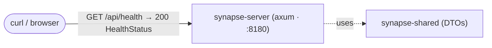

# Step 01 — Hello, synapse-rs: the walking skeleton and its discipline

*(oracle: synapse steps 01–02 — Hello-World + dev loop, typed `/api/health`, logging, AppConfig,
the hexagonal `platform` context; plus the CI convention gate that synapse only grew post-book)*

The first slice is the smallest thing that proves the whole shape: a typed endpoint served by the
real stack, tested through the real stack, guarded by every gate the rest of the book will lean
on. Nothing lands in step 02 that step 01's toolchain wouldn't catch.

## HLD delta

## The workspace

Two crates (the Leptos client joins in step 02):

- **`shared/`** — the shared kernel (RS001): wire DTOs both sides need. Today:
  `HealthStatus { status }` and the `ApiError { error, detail?, hint? }` envelope every context
  will reuse, exactly as the oracle keeps `ApiError` in its generated `Endpoints` even before a
  path references it (ADR-S019).
- **`server/`** — pragmatic hexagonal by bounded context (ADR-S007's shape, re-derived). The
  `platform` context debuts thin and flat: `health.rs` (the use case) + `http.rs` (the inbound
  adapter). Health is a **free function, not a trait** — there is no output dependency to invert
  yet, and a single-impl trait would be ceremony without a seam; the first real port debuts with
  `catalog`, as it did in the oracle.

`lib.rs` assembles the router (`app()`) and derives the OpenAPI document (`ApiDoc`); `main.rs` is
the wiring point — config + tracing + serve, and the only place `anyhow` is welcome.

## Config

`AppConfig` (figment): defaults in code, overridden by **`SYNAPSE_`-prefixed env** —
deliberately *not* the bare `PORT`, which preview tooling injects and must never hijack the bind
(the oracle's launch.json `unset PORT` gotcha, promoted here into a unit test that sets a decoy
`PORT` and proves it is ignored).

## Logging (ADR-S009 parity)

`tracing` with a dev-friendly default filter (`info`, `debug` for our crates; `RUST_LOG`
overrides). The route logs its INFO milestone, the use case its DEBUG internals — the layered
trace every later endpoint follows.

## The contract lock

`api/openapi.oracle.yaml` is a committed copy of Synapse's `api/openapi.yaml`. The
`contract_it.rs` suite renders the utoipa document and asserts: every oracle path/method is
served, and every oracle schema agrees on property names and required fields. The oracle copy
grows in lock-step as endpoints are ported — drift from the Scala contract is a red test, not a
production surprise. This replaces tapir's single-source-of-truth endpoint definitions.

## The gates (all in CI from this step, `ci.yml`)

1. **`dev-tools/check-conventions.sh` first** (needs only grep/find/wc): server `domain/` purity
   (no axum/tower/hyper/tokio/sqlx/reqwest/utoipa), client `logic/` purity (no
   leptos/web-sys/wasm-bindgen — armed now, bites from step 02), file caps (server/shared ≤ 500,
   client ≤ 800).
2. **rustfmt** (`max_width = 110`).
3. **clippy at `-D warnings`**, all + pedantic, with the anti-pattern lints as workspace law:
   `forbid(unsafe_code)`; deny `unwrap_used` / `expect_used` / `panic` (test files opt out
   explicitly — hard asserts are the point there). Curated pedantic allows are named in the root
   `Cargo.toml`; proper nouns live in `clippy.toml`'s `doc-valid-idents`.
4. **`cargo test --workspace`** — unit + integration + contract lock.

## Tests (integration-first, RS001)

- `server/tests/health_it.rs` — drives the **real assembled router** end-to-end: 200, JSON
  content type, the exact `{"status": "ok (walking skeleton)"}` body; unknown routes 404.
- `server/tests/contract_it.rs` — the contract lock above.
- `config` unit tests — default port; `SYNAPSE_PORT` override wins while a decoy `PORT` is ignored.

## Dev loop

`dev-tools/dev` — `cargo watch` when installed, plain `cargo run` otherwise; server on `:8180`
(same dev port convention as the oracle; override `SYNAPSE_PORT` to run both side by side).
`dev-tools/synapse-rs.insomnia.json` starts its life with `GET /api/health` and, per the oracle's
standing rule, is updated in the same step as every endpoint change — never allowed to drift.

## Verified

`cargo test --workspace` (6 tests), clippy `-D warnings`, rustfmt, and the convention gate all
green; smoke-run confirms `GET /api/health` → `{"status":"ok (walking skeleton)"}` and 404 on
unknown routes, with the INFO start milestone (`synapse-rs server started port=8280`) under a
`SYNAPSE_PORT` override.
