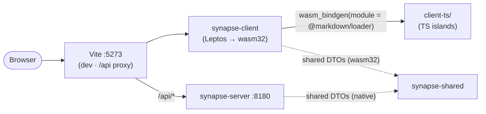

# Step 02 — Leptos and the island bridge

*(the de-risking step: the two mechanics everything client-side depends on — wasm-bindgen ↔ Vite
↔ TS-island chunking, and the WASM bundle's weight — proven before anything is built on them)*

The client is a Leptos (CSR) crate compiled by wasm-pack and served by Vite — the same Vite that
owns the oracle's TS islands. Step 02 ships a throwaway probe page whose mechanics are NOT
throwaway: every pattern on it is the exact pattern the features will use.

## HLD delta

## The island bridge (the risky unknown, now known)

The oracle's pattern: a tiny **loader** module per island, statically imported, that
dynamic-imports its heavy renderer — so Monaco/mermaid/markdown never ride the critical path.
Rust reproduces it exactly:

- `client/src/islands/markdown.rs` — `#[wasm_bindgen(module = "@markdown/loader")]` extern
  returning a `js_sys::Promise`, awaited via `wasm_bindgen_futures`. The `islands/` module tree
  is the ONLY place the client touches JS (the narrow-interop rule; the oracle held it to 11
  files).
- `client-ts/markdown/loader.ts` — `export async function renderMarkdown` that
  `await import("./render")`.
- Vite's `@markdown` alias resolves the bare specifier **inside the wasm-bindgen glue**; the
  dynamic import gives the renderer its own chunk.

Verified in the built output: `render-*.js` is a separate 0.5 KiB chunk, requested lazily at
runtime (watched it load in the network log). `render.ts` itself is a walking-skeleton renderer
(headings/paragraphs/bold/code) — the contract is what matters; the oracle's full pipeline ports
verbatim behind this same loader in step 06.

## The probe page (three proofs)

1. **Signals** — `RwSignal` counter, click → re-render (Laminar `Var` → Leptos `RwSignal`).
2. **TS island** — markdown rendered across the boundary into `inner_html`.
3. **Shared DTO** — `GET /api/health` through the Vite proxy, decoded into the same
   `synapse_shared::api::HealthStatus` the server serialized: the shared kernel compiles and
   agrees on `wasm32`.

All three verified live in the browser (plus zero console errors), including the click.

## The bundle baseline (the other unknown)

`npm run build` (wasm-pack `--release`, wasm-opt on, Vite prod):

| Asset | gzipped |
|---|---|
| entry JS | ~7 KiB |
| wasm module | ~165 KiB |
| **critical path** | **~171 KiB** |

The oracle's Scala.js entry was ~610 KiB gz against a 700 KiB budget. The budget carries over
unchanged (`dev-tools/check-bundle-budget.sh`, in CI) — Leptos+wasm starts with 3.5× the
headroom, to be spent deliberately as features land.

## Build & dev plumbing

- `client/` is BOTH a cargo crate and the npm/Vite root (the oracle's layout): `npm run wasm`
  (wasm-pack → `pkg/`, gitignored) then Vite; `main.ts` boots `init()` with an explicit wasm URL
  so the asset stays under Vite's control.
- `dev-tools/dev` now runs the whole loop: wasm dev build → server :8180 (bg) → Vite :5273 (fg).
  `.claude/launch.json` gets the `synapse-rs` config (port 5273). The injected-`PORT` gotcha is
  harmless by construction here — the server only reads `SYNAPSE_PORT`.
- CI grows a `client-build` job: wasm32 target (pinned in `rust-toolchain.toml`), wasm-pack,
  `npm ci && npm run build`, then the bundle budget. The native jobs already lint/compile the
  client crate (leptos compiles on native), so clippy's anti-pattern gate covers it too.
- The `logic/` purity gate (no leptos/web-sys/wasm-bindgen under `client/src/*/logic/`) is armed
  and running — it bites when the first feature grows its three-layer split.

## Verified

Native gates (fmt, clippy `-D warnings`, conventions, 6 tests) green with the client crate in the
workspace; wasm + Vite production build green; bundle budget 171/700 KiB gz; in-browser: header
shell renders (light background fixed for dark-mode browsers), counter clicks, island HTML
crosses the boundary, `HealthStatus` decodes — no console errors.
