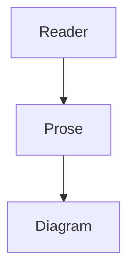
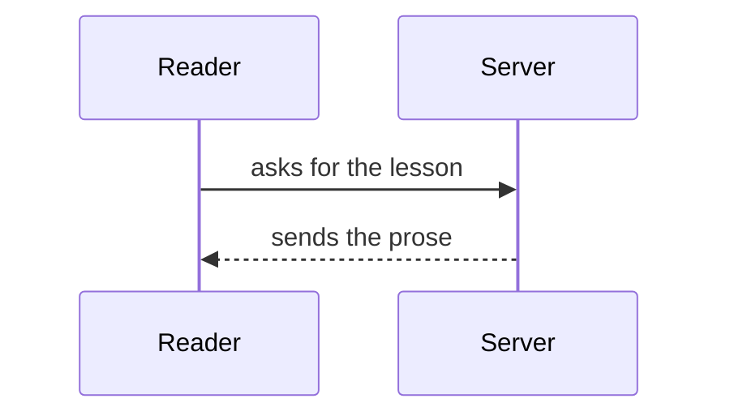

# Getting started

This lesson exists so the end-to-end suite has something deterministic to render. Real content
lives in `synapse-content`; pinning the smoke suite to it would mean an unrelated edit there
could turn this repository's CI red, which is the wrong coupling for a smoke test.

It carries a little of everything the reader has to survive: a paragraph long enough that the
body is unmistakably populated rather than merely mounted, a list, a table (tables are what
overflowed the phone in step 46), and a fenced code block.

- A list item, so list styles are exercised.
- A second one.
- A third, for good measure.

| Column | Another | A third |
|---|---|---|
| a value | another value | a third value |
| more | and more | and more again |

```python
def greet(name: str) -> str:
    return f"hello, {name}"
```

That is enough prose to put this comfortably past the length assertion without being a wall of
filler. The suite checks structure and behaviour, never wording.

// Diagram: A single still, captioned by the line above it


// Interactive Diagram (3 frames): Three stills the reader steps through


// Diagram: A marker with no image under it, which must stay readable prose

A mermaid fence renders through a different engine, and gets the same chrome a d2 figure does:
it enlarges, and its Edit pill opens `/mermaid` on this exact fence.



A lone d2 fence is drawn by the SERVER, so this one is here to prove the SVG reaches the reader
in the HTML itself rather than after a multi-megabyte engine download.

```d2
lone -> figure
```

Two adjacent d2 fences are one step-through figure, so the suite has a second stepping transport
to hold to the same contract as the frame one.

```d2
first -> second
```

```d2
second -> third
```

A ```d2 boards fence is one source that compiles to a TREE of boards, drawn into this lesson's
own `_d2/` sidecar rather than the shared pool. Clicking a linked node drills into that board.

```d2 boards name="smoke-walkthrough" root="Context"
system: "The system" {
  link: layers.inside
}
person: "A reader"
person -> system

layers: {
  inside: {
    api: "The API" {
      link: _.layers.deeper
    }
    store: "The store" { shape: cylinder }
    api -> store
  }
  deeper: {
    handler: "The handler"
    cache: "The cache"
    handler -> cache
  }
}
```

A SECOND mermaid fence, after four d2 fences, because the two editors index two lists: this one is
mermaid diagram 1, not diagram 5. A shared counter would send its Edit pill to a d2 figure.


